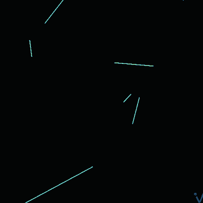

  

<h1>Hi, I'm Thatila 👋</h1>

<h3>
Aspiring AI Engineer • Computer Science Undergraduate  
Computer Vision • Machine Learning • AI Automation
</h3>

 

---

# 🧠 About Me

I'm a **Computer Science Undergraduate** at **Eastern University, Sri Lanka**, passionate about building intelligent systems using **Artificial Intelligence, Computer Vision, Machine Learning, and AI Automation**.

I enjoy solving real-world problems through software while combining technical knowledge with creativity. My background in **Graphic Design, UI/UX Design, Video Editing, and 3D Modeling** helps me build products that are both functional and visually engaging.

- 🔭 Currently studying **Computer Science**
- 🤖 Exploring **AI Agents, Machine Learning, Computer Vision & Automation**
- 🌱 Learning modern AI frameworks and intelligent systems
- 🎨 Strong interest in UI/UX and creative development
- 💼 Open to internships, research opportunities, freelance work, and entry-level AI roles
- ⚡ I enjoy transforming ideas into polished digital experiences.

---

# 🛠 Tech Stack

### 🤖 AI / ML / Automation

### 💻 Programming & Web

### 🎨 Design & Creative

### ⚙️ Tools

---

# 🚀 Featured Projects

| Project | Description |
|---------|-------------|
| 🤖 **AI Meeting Delegate Platform** | AI-powered meeting avatar with voice cloning, LiveKit, Deepgram & Gemini |
| 🎬 **Cinematic Portfolio Website** | Interactive portfolio with cinematic animations |
| 🏏 **Él-Épico Event Platform** | Sports event management platform |
| 📊 **Campus Dashboard** | Data visualization and analytics platform |
| ⚙️ **OS Process Simulator** | CPU scheduling & operating system simulator |

---

# 📊 GitHub Statistics

  

---

# 🌱 Currently Learning

- 🧠 Computer Vision
- 🤖 AI Agents
- 🔥 Large Language Models (LLMs)
- ⚡ AI Automation
- 📊 Deep Learning
- ☁️ Cloud AI Deployment

---

# 🤝 Let's Connect

I'm always interested in collaborating on **AI, Machine Learning, Computer Vision, Automation, and Open Source Projects**.

